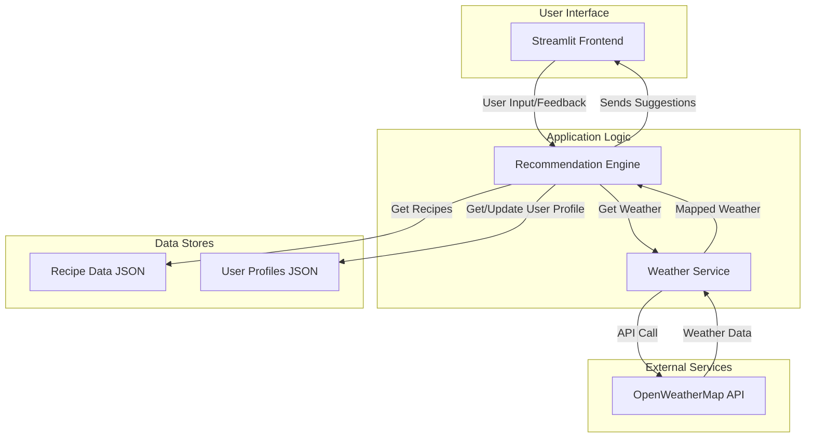

# What2Eat: System Architecture and Implementation Plan

This document outlines the system architecture and implementation plan for the What2Eat Streamlit application.

## 1. System Architecture

### 1.1. Recipe Data Structure

The recipe data will be stored in a JSON file (`recipes.json`). Each recipe will have the following structure:

```json
{
  "id": 1,
  "name": "Masala Dosa",
  "cuisine": "South Indian",
  "meal_type": ["breakfast", "lunch"],
  "ingredients": ["rice", "lentils", "potato", "onion", "spices"],
  "weather_suitability": ["any"],
  "tags": ["classic", "savory"]
}
```

### 1.2. Recommendation Engine

The recommendation engine will use a scoring system to suggest recipes. The total score for each recipe is calculated as:

**Total Score = User Preference Score + Weather Match Score + Filter Match Score**

-   **User Preference Score:** Based on a user profile that learns from explicit feedback (likes/dislikes) and implicit feedback (clicks).
-   **Weather Match Score:** Boosts recipes that match the current weather conditions (hot, cold, rainy).
-   **Filter Match Score:** Prioritizes recipes that match the user's immediate filters (e.g., cuisine, meal type).

### 1.3. Weather API Integration

-   **Service:** OpenWeatherMap API (free tier).
-   **Implementation:** A `weather_service.py` module will fetch data from the API.
-   **Mapping:** Weather conditions (e.g., "Rain", temperature) will be mapped to our `weather_suitability` tags.

### 1.4. User History and Preference Storage

-   **Method:** A local `user_profiles.json` file will be used to store user data.
-   **Structure:** The file will contain a dictionary where keys are usernames and values are their learned preference scores.

### 1.5. System Architecture Diagram



## 2. Implementation Plan

### Phase 1: Project Setup and Core Components
1.  **Initialize Project:** Set up a Python project with a virtual environment and a `requirements.txt` file (`streamlit`).
2.  **Create Recipe Data:** Create and populate `recipes.json` with sample recipes.
3.  **Basic Streamlit App:** Create `app.py` with a basic UI.
4.  **Implement Weather Service:** Create `weather_service.py` to integrate with OpenWeatherMap.

### Phase 2: Recommendation Engine and User Interaction
5.  **Build Recommendation Engine:** Create `recommendation_engine.py` with the scoring logic.
6.  **Integrate Engine with App:** Connect the engine to the Streamlit app.
7.  **Implement User Profiles:** Add logic to manage `user_profiles.json`.
8.  **Add Feedback Mechanism:** Add "Like" and "Dislike" buttons.

### Phase 3: Refinement and Deployment
9.  **Refine UI/UX:** Improve the application's layout and user experience.
10. **Testing:** Thoroughly test all application components.
11. **Deployment:** Prepare the application for deployment (e.g., Streamlit Community Cloud).